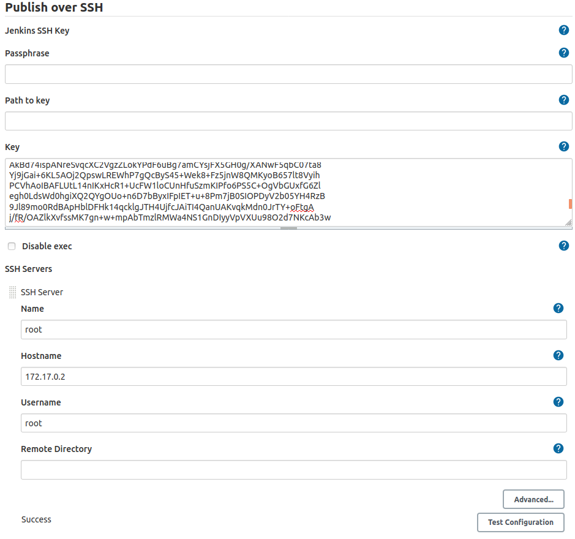
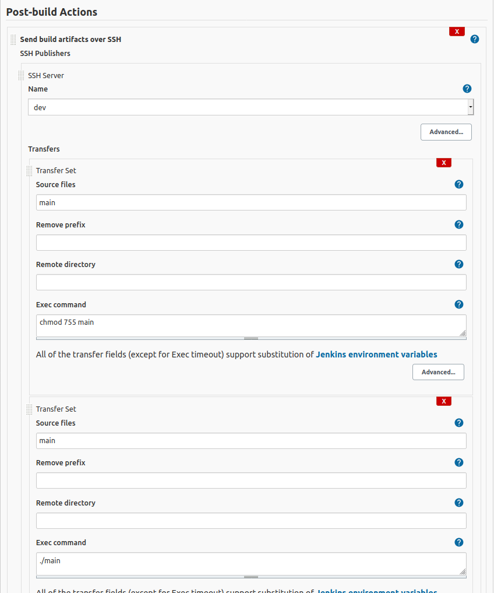

# A Jenkins Tutorial : Installation and first project


What does Jenkins offer ? 
> Continuous Integration and Continuous Delivery
> Plugins
> Easy installation
> Extensible
> Easy configuration
> Distributed

## Installation
### Docker Images : Ubuntu + Jenkins
1. Ubuntu Image 

```sh
docker pull ubuntu 
docker run -it ubuntu ubuntu /bin/bash
```
These commands will :
- pull the docker image from library/ubuntu with default tag 'latest'
- run the image and enter in container, add the '-d' option to detach it

There are some things to do before using this image : 
- install openssh-server
```sh
apt-get update
apt-get install openssh-server
service ssh restart
```
- create a id_rsa (public & private)
```sh
ssh-keygen -t rsa -b 4096 -m PEM
```
> The default method (ssh-keygen -t rsa) causes problems in the jenkins configuration when trying to connect in SSH. This command is important to have a valid rsa.
-  copy the ~/.ssh/id_rsa.pub contents into ~/.ssh/authorized_keys as we’ll be using the private key on the Jenkins server.
- Change the rights of files and folder to avoid errors : 
```sh
chmod 700 ~/.ssh
chmod 600 ~/.ssh/authorized_keys
```

Should be **OK** for ubuntu part ! (ubuntu docker will be useful to have a build env and a client for jenkins with its own IP)


2. Jenkins Image

Dockerfile content : 
```dockerfile
FROM jenkins/jenkins
USER root
RUN mkdir /var/log/jenkins
RUN mkdir /var/cache/jenkins
RUN chown -R jenkins:jenkins /var/log/jenkins
RUN chown -R jenkins:jenkins /var/cache/jenkins
USER jenkins
 
ENV JAVA_OPTS="-Xmx8192m"
ENV JENKINS_OPTS="--handlerCountMax=300 --logfile=/var/log/jenkins/jenkins.log --webroot=/var/cache/jenkins/war"
```

> Common Jenkins Dockerfiles on the net have problems while installing plugins... 
### Plugins

| Plugin | Documentation |
| ------ | ------ |
| Publish Over SSH | [link](https://plugins.jenkins.io/publish-over-ssh/) |
| SSH | [link](https://plugins.jenkins.io/ssh/) |
| PostBuildScript | [link](https://plugins.jenkins.io/postbuildscript/) |

## Configuration
### Build section

In the build section goes : 
- the dependencies download
- the tests 
- the build

### Publish over SSH



hostname can be found with : 
```sh
hostname -I
```

### Post build actions



In the SSH Server, we select the remote machine where we have to transmit the built and tested software.
Change the rights of the binary in the first transfer set and launch it in the second transfer set.
